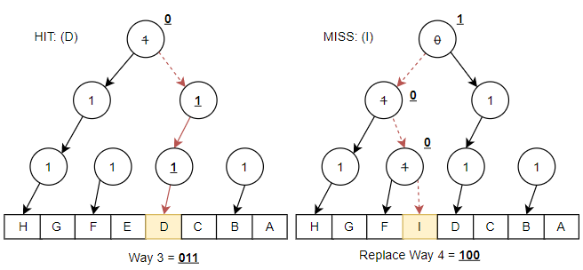
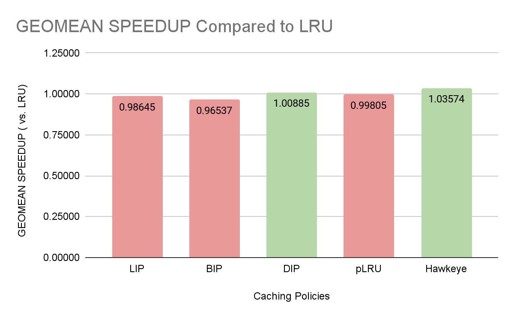

University of British Columbia  

*Isabelle Andre*  

# Table of Contents
1. [LRU Insertion Policy (LIP)](#lru-insertion-policy-lip)
2. [Bimodal Insertion Policy (BIP)](#bimodal-insertion-policy-bip)
3. [Dynamic Insertion Policy (DIP)](#dynamic-insertion-policy-dip)
4. [Tree-Based Pseudo-LRU Policy (pLRU)](#tree-based-pseudo-lru-policy-plru)

# Lab 2 High-Performing Cache Replacement Policies  
This assignment consisted in implementing high-performance and industry-grade cache-replacement policies for the shared Last Level Cache (LLC). The ChampSim simulator is used to implement, execute, and test caching policies. More specifically, we focus on the implementation and surface-level performance analysis of 4 different caching policies: LIP, BIP, DIP, and pLRU. The performance of these algorithms are showcased using spec2006 integer benchmarks. Finally, we compare the performance of these caching policies using cumulative IPC, hit rate, miss latency, and their IPC geomean, as compared with LRU.

## LRU Insertion Policy (LIP)
### Description
The LRU Insertion Policy (LIP) is a cache insertion policy placing the incoming line in the LRU position rather than the MRU position, as LRU would normally do. This protects the cache from thrashing, resulting in an optimal hit-rate for working sets greater than the cache size, and applications having a cyclic access pattern. These lines are only promoted from LRU to MRU if they get referenced while in the LRU position.

### Implementation
This policy was implemented very similarly to LRU, with the only difference being that on a cache insert, the line is first inserted in the LRU position rather than MRU. Then, on a hit anywhere in a set, the line is promoted to the MRU position. Therefore if a line other than the LRU or MRU is hit, the caching policy remains the same as LRU, and the block is moved to the MRU position. The eviction policy remains the same as the initial LRU policy as well.

## Bimodal Insertion Policy (BIP)
### Description
As LIP lacks an aging mechanism, the Bimodal Insertion Policy (BIP) allows the insertion of an incoming line with a low probability into the MRU position. BIP therefore adapts to changes in the working set while retaining the thrashing protection properties of LIP. BIP tends to perform better than LRU for some benchmarks whereas it may perform worse for others, although memory and time overheads are similar to that of LRU.

### Implementation
BIP is implemented using a bimodal throttle (epsilon) value of 5%. Upon cache line insertion, a random value between 0 and 1 is generated using current system time as a seed, and compared with the bimodal throttle value. If the randomized value is less than the throttle, LRU is used, and the block inserted at the MRU, otherwise LIP is selected and the block is placed at the LRU. Therefore, LIP is used the majority of the time as epsilon moves toward zero.

## Dynamic Insertion Policy (DIP)
### Description
The Dynamic Insertion Policy (DIP) chooses to apply either the traditional LRU policy or BIP by monitoring which policy performs best before applying it. Set Dueling (SD) is used in order to avoid a large hardware overhead by selecting a number of dedicated sets to monitor the competing policies. The remaining follower sets use the best performing policy out of the two, based on the number of misses. A single saturating Policy Selector counter is used to keep track of the number of misses incurred in dedicated sets belonging to either policy. A miss in an LRU dedicated set will increment the (PSEL) counter, while a miss in a BIP dedicated set will decrement the PSEL counter.

### Implementation
Our DIP-SD implementation uses BIP with an epsilon value of 5%, and LRU. To implement set-dueling and set-sampling, 64 sample sets are dedicated to each policy, and an 11 bit PSEL saturating counter is used to choose a policy for the follower sets.  
In our implementation, the 11 bit PSEL counter is used in decimal format to simplify the code. For an 11 bit PSEL counter, the maximum counter value is 2048, and the minimum counter value is 0. As the mid-range of the counter at which the MSB becomes 1 is 1024, a counter value of 1024 or above will result in BIP to be used for follower set insertion, while a counter value of less than 1024 will result in LRU to be used for insertion.  

Dedicated sets for LRU and BIP may be allocated using complement selected sets, statically chosen sets, or randomization. Our implementation dedicates 64 sets at random to each of the two policies LRU and BIP using current system time as a seed. An array of randomized set numbers is created to keep track of which randomized sets belong to each policy. Array elements [0, 64) belong to LRU while elements [64, 128) belong to BIP. Upon a cache hit, the set number is compared to both sections of the array to determine which policy will be used, otherwise chosen according to the PSEL counter state.

## Tree-Based Pseudo-LRU Policy (pLRU)
### Description
Similarly to LRU, the Pseudo-LRU Policy (pLRU) efficiently selects a line that has likely not been accessed recently, given a sequence of access events to cache blocks. This policy is best represented by a binary tree approximation of the LRU algorithm. The tree bits encode the paths towards the leaves, pointing to each way of the set.

Following the direction of the pointers indicates the pseudo LRU line. When a hit occurs, the bits on the path to the line are flipped to indicate the opposite part of the tree as pseudo LRU. As such, the last accessed data is protected from eviction by inversion each node leading to it. However due to the nature of binary trees, each node may only contain one bit of information, resulting in a loss of history.

### Implementation
Our implementation of the pLRU algorithm consists in creating an array of binary trees containing a dedicated tree for each set of the cache. Node structures contain a single bit indicating the direction of the pseudo LRU line, and a pointer to its left and right child nodes. Each tree is first initialized with a depth or height of log2(num ways) to ensure that each Way can be pointed to.

On a cache hit, the way number is first converted to its binary value. For instance, as shown in Figure 2.4.1, way 3 would correspond to 011. When traversing through the tree, each node along the path is modified to the corresponding value to point towards the pseudo LRU.

On an eviction, the LRU is chosen as the victim to evict. First, the tree is traversed to flip the bit contained within each node. The tree data now points to the LRU. This cache line is evicted, and immediately replaced by the incoming line.

*Figure 2.1: Binary Tree traversal on cache Hit and bit flips on Miss*

## Performance Comparison
The performance of our 4 caching policies are compared with the LRU policy performance using IPC, Instruction Hit Rate, and Miss Latency, as shown in Table 3.1.

| **Metric**                   | **Description**                                                                                                      |
|------------------------------|----------------------------------------------------------------------------------------------------------------------|
| ROI_Cumulative_IPC           | Cumulative Instructions per Cycle. A higher IPC indicates an increase in performance.                                |
| ROI_LLCTOTAL_HITRATE         | Total Instruction Hit Rate. A higher Hit rateindicates a decrease in latency and increase in performance.            |
| ROI_LLCLOAD_HITRATE          | LLC LOAD Instruction Hit Rate. A higher Hit rate indicates a decrease in latency and increase in performance.        |
| ROI_LLCWRITEBACK_HIT RATE    | LLC Writeback Instruction Hit Rate. A higher Hit rate indicates a decrease in latency and increase in performance.   |
| ROI_LLCAVERAGE_MISS_ LATENCY | LLC Average Latency incurring due to a miss. A higher average latency on a miss indicates a decrease in performance. |  

*Table 3.1: Performance Metrics for Caching Policy Comparison*

### Performance Per Benchmark
The caching policies of LRU, LIP, BIP, DIP, and pLRU are analyzed by comparing the performance metrics described in Table 3.1 from each of the spec2006 benchmarks. The spec2006 benchmarks used include 400.perlbench, 401.bzip2, 403.gcc, 429.mcf, and 462.libquantum.

### Geomean
To calculate the geomean of each caching policy IPC compared to LRU, we first normalize the data to calculate individual speedups for each workload, then take the quintic root of all speedups multiplied.

$$ Policy Speedup Over LRU per Workload = {Policy IPC \over LRU IPC} $$

$$ GEOMEAN(LRU, Policy) = {\sqrt[5]{Workload 1 * Workload 2 * Workload 3 * Workload 4 * Workload 5}} $$

The resulting Geomean of each policy compared to LRU IPC is shown in Figure 3.7.

*Figure 3.7 Geomean of Caching Policies Compared to LRU*

## Conclusion
While each caching policy has its advantages and disadvantages, LRU generally outperforms other policies in this assignment as it is an optimized version by Intel. The policies nearest to LRU’s performance according to the Geomean of IPC are DIP and pLRU, with DIP rivaling LRU’s performance, and BIP having the worst speedup. However LRU’s miss latency tends to be much greater than others, with BIP or LIP having the lowest latency. For a more thorough review of these caching policy performances, further testing with mixed workloads and a greater variety of benchmarks and performance metrics should be executed.

## References
*Qureshi, Moinuddin & Jaleel, Aamer & Patt, Yale & Jr, Simon & Emer, Joel. (2007). Adaptive insertion policies for high performance caching. ACM Sigarch Computer Architecture News. 35. 381-391. 10.1145/1273440.1250709.*

*Wu, Carole-Jean & Jaleel, Aamer & Hasenplaugh, Will & Martonosi, Margaret & Jr, Simon & Emer, Joel. (2011). SHiP: Signature-based Hit Predictor for High Performance Caching. 10.1145/2155620.2155671.*

*Jaleel, Aamer & Theobald, Kevin & Jr, Simon & Emer, Joel. (2010). High performance cache replacement using re-reference interval prediction (RRIP). ACM Sigarch Computer Architecture News. 38. 60-71. 10.1145/1816038.1815971.*

*Damies, Gilles. (2007). Study of different cache line replacement algorithms in embedded systems. ARM France SAS.*