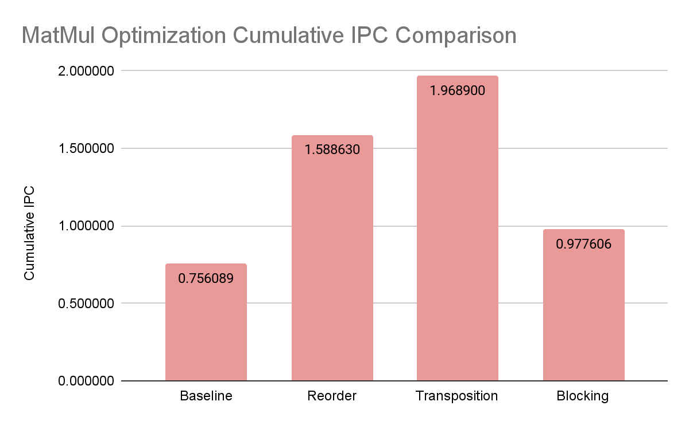
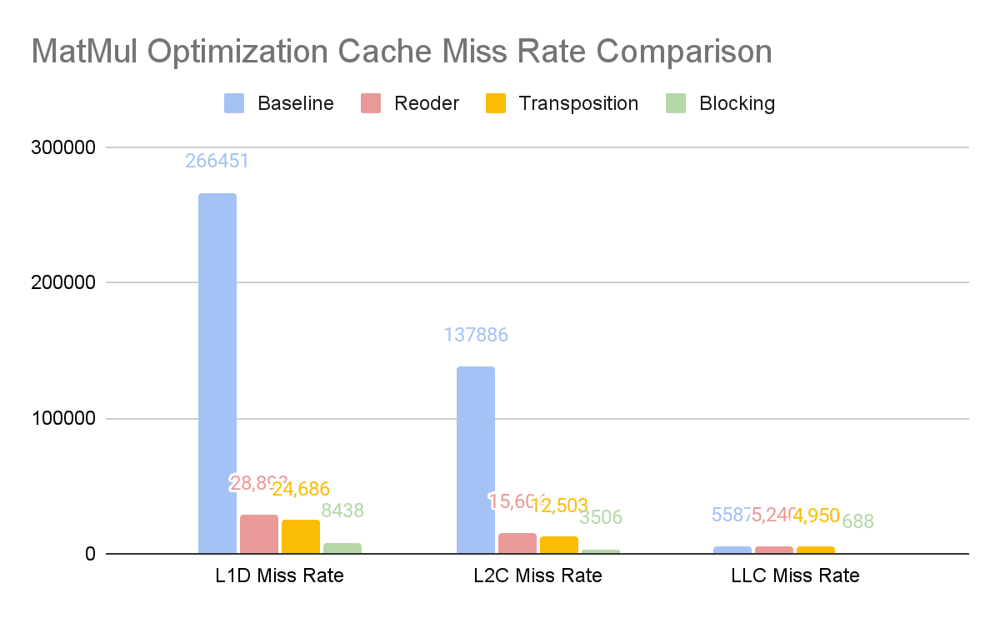

University of British Columbia  

*Isabelle Andre*  

# Table of Contents
1. [Baseline Matric Multiplication](#baseline-matrix-multiplication)
2. [Loop Reordering](#loop-reordering)
3. [Matrix Transpose Optimization](#matrix-transpose-optimization)
4. [Memory Blocking Optimization](#memory-blocking-optimization)

# Lab 3 Architectural Simulator and Code Optimization 
This assignment consisted in understanding the implementation of architectural simulators and how to generate traces for the simulator from applications. A naive matrix multiplication function was provided to be optimized in speedup and memory. In Part A, we explore the simulator’s pipelined architecture and implement a non-pipelined core by modifying the current out-of-order core implementation of ChampSim. In Part B and this report, we optimize the basic matrix multiplication implementation by achieving 30% speed-up using loop reordering and matrix transposition, and reducing the L1D cache miss-rate by 8x by using blocked matrix multiplication.

## Matrix Multiplication Optimization
Matrix multiplication is an important operation used in multiple programming applications and convolutions in neural network instances. In applications requiring highly optimized code for machine learning applications, it is beneficial to optimize this operation to have cache-friendly access and avoid data dependencies by restructuring the code, while retaining its initial function.

### Baseline Matrix Multiplication
#### Description
The naive matrix multiplication implementation uses a triple nested for loop structure to multiply two matrices:

$$ C_ij = {\sum{k=1}^b A_ik * B_kj} $$

As this method takes an iterative and exhaustive approach to multiplication, this method can be optimized to avoid RAW data dependencies and fill the cache in more effective ways.

#### Implementation
With a matrix size of N, the total time complexity for this method is 𝑂(𝑛^3).

```
for(unsigned long long int i=0; i<matrix_size; i++){
    for(unsigned long long int j=0; j<matrix_size; j++){
        for(unsigned long long int k=0; k<matrix_size; k++){
            mat_c[j*matrix_size + i] += mat_a[k*matrix_size + i] * mat_b[j*matrix_size + k];
        }
    }
}
```

### Matrix Multiplication Optimizations
As most algorithms process and execute operations over large quantities of data, optimizing the cache access and usage is the first and most efficient way to improve performance. Memory acts as a bottleneck to CPU performance, and by improving memory usage, it is also possible to improve other performance metrics such as IPC.

#### Loop Reordering
Loop reordering explores the effects of locality of reference in cache memory. As the matrix is stored in row-major order, everytime the inner-loop is incremented, an entire row of the matrix is skipped, therefore jumping further into memory blocks than cached values. Applying reordering improves performance gains by increasing the spatial locality of data. This presents an optimization allowing to eliminate cache misses on each iteration of the inner loop i.

#### Loop Reordering Implementation
This method increases the time complexity by as compared 𝑂(𝑛^2) to the previous.

```
for(unsigned long long int j=0; j<matrix_size; j++){
    for(unsigned long long int k=0; k<matrix_size; k++){
        for(unsigned long long int i=0; i<matrix_size; i++){
            mat_c[j*matrix_size + i] += mat_a[k*matrix_size + i] * mat_b[j*matrix_size + k];
        }
    }
}
```

### Matrix Transpose Optimization
One of the fundamental problems of naive matrix multiplication is that when iterating through matrix B, n elements are jumped over as a column is iterated. The Matrix Transpose method consists in storing matrix B and transposing it prior to the matrix multiplication. While this optimization increases the time complexity by O(n^2), sequential reads are guaranteed in the 3rd nested loop, 𝑂(𝑛 optimizing serial 2) caching access and spatial locality. Spatial locality may be even further optimized when used in conjunction with loop reordering or blocking. In our code, matrix transpose is used in combination with loop reordering previously used in Section 2.2 to further optimize it.

This method is implemented in matmul_opt1 of Part B of this assignment, to optimize the IPC by 30%.

#### Memory Blocking Optimization
Memory blocking can be used to optimize the caching mechanism, employing temporal locality properties of caches. In block matrix multiplication, the matrix is divided into multiple S x S sub-matrices before multiplying corresponding blocks. S should be a multiple of the cache line size for best results. As each cache line size spans 64 bytes and unsigned long long ints used to iterate the matrix rows and columns in the code are 8 bytes, we choose the block size S in our implementation to be the cache line size divided by the unsigned long long int size, equivalent to 8 bytes each.

Blocking allows the code to store a block into the cache and complete all writes and reads at once before evicting the block and repeating the process for the next, therefore improving the temporal locality of the nested for loops. This method is used in addition to loop reordering to further optimize both IPC and caching efficiency.

We use this method in matmul_opt 2 of Part B of this assignment to optimize the memory usage and decrease L1D cache misses by over 8x, and while a noticeable improvement is seen in cache misses, branch accuracy lowers by almost 20%.

### Speedup and Memory Comparison
A breakdown of the performance metrics for the naive matrix multiplication and both of the above optimized matrix multiplications are shown in Table 2.2.

| **Metric**                 | **Baseline** | **Reorder** | **Transposition** | **Blocking** |
|----------------------------|--------------|-------------|-------------------|--------------|
| Cumulative IPC             | 0.756089     | 1.58863     | 1.9689            | 0.977606     |
| L1D Miss Rate              | 266,451      | 28,898      | 24,686            | 8438         |
| L2C Miss Rate              | 137,886      | 15,604      | 12,503            | 3506         |
| LLC Miss Rate              | 5,587        | 5,240       | 4,950             | 688          |
| Branch Prediction Accuracy | 99.2247      | 99.2247     | 99.2231           | 80.0205      |  

*Table 2.2: Performance Metrics Breakdown for Naive and Optimized Matrix Multiplication*

#### Speedup

$$ Reorder Speedup = {Reorder IPC \over Naive IPC} = 2.10111 $$

$$ Transpose Speedup = {Transpose IPC \over Naive IPC} = 2.60405 $$

$$ Blocking Speedup = {Blocking IPC \over Naive IPC} = 1.292977 $$

#### Memory Optimization Improvement

$$ Reorder L1D Improvement = {Baseline L1D Miss \over Reorder L1D Miss} = 9.22x $$

$$ Transpose L1D Improvement = {Baseline L1D Miss \over Transpose L1D Miss} = 10.8x $$

$$ Blocking L1D Improvement = {Baseline L1D Miss \over Blocking L1D Miss} = 31.57x $$

### Plotted Comparison
Comparing each method’s cumulative IPC, it is observed that while the Reorder method has a large increase in performance, Transposition even further increases its computational density, as further improvements to spatial locality are applied. Figure 2.1 shows the IPC of the optimized matrix multiplications as compared to the baseline naive method.



*Figure 2.1: IPC Metrics Comparison for Naive and Optimized Matrix Multiplication*

Figure 2.2 compares the cache miss rates of the optimized matrix multiplications as compared to the baseline naive method. While the LLC cache miss rates are all approximately the same for Naive, Reordering, and Transpose methods, a large improvement is seen when reordering and transposing for L1D and L2C, with the largest improvement seen from Memory blocking in all three caches.

Figure 2.3 shows the branch prediction accuracy of each method, and shows little improvement in any of the optimizations, with Memory blocking having the lowest performance by almost 20%, likely due to patterns more difficult to predict.



*Figure 2.2: Cache Miss Metrics Comparison for Naive and Optimized Matrix Multiplication*

## Conclusion
As matrix multiplication is a fundamental operation used in deep learning, its optimization is a topic of interest in many scientific applications. It can be improved in a variety of ways using methods to improve its spatial and temporal locality.

Loop reordering was explored to improve the spatial locality of the cache accesses, by reordering the nested for loops such that it is less likely to incur cache misses in the inner loop. Matrix transposition was then used to store and transpose matrix B prior to multiplication to guarantee sequential reads in the 3rd nested loop. This optimizes serial caching access and spatial locality, showing a speedup of speedup of 2.6 compared to the naive method.

Memory blocking was then used to improve the spatial and temporal locality of the cache, showing 31.5x less cache misses than the naive method. While its branch prediction performance is much lower, it shows a much better performance in caching access.

There are many more memory optimizations to explore individually or in conjunction with some of the methods presented in this assignment, such as row-wise multiplication, vectorizing, etc.

## References
*Sarband, N.M., Gustafsson, O. & Garrido, M. Using Transposition to Efficiently Solve Constant Matrix-Vector Multiplication and Sum of Product Problems. J Sign Process Syst 92, 1075–1089 (2020). https://doi.org/10.1007/s11265-020-01560-z*

*Hennessy, John L & Patterson, David A. (2012). Computer Architecture, A Quantitative Approach. Morgan Kaufmann. 5th Edition. http://acs.pub.ro/~cpop/SMPA/Computer%20Architecture%20A%20Quantitative%20Approach%20(5th%20edition).pdf*