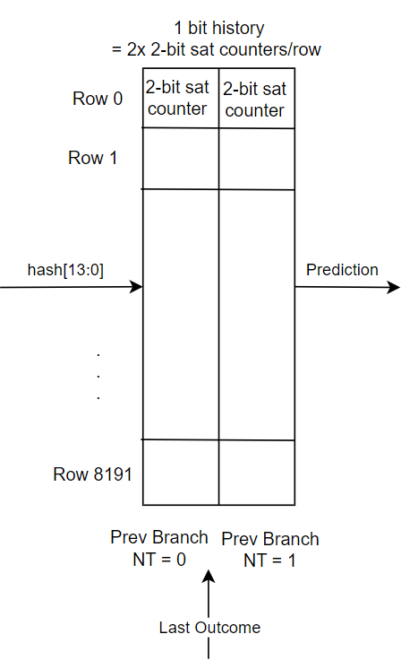
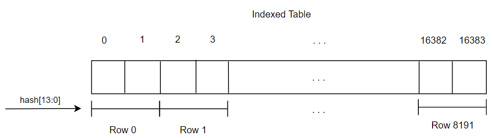
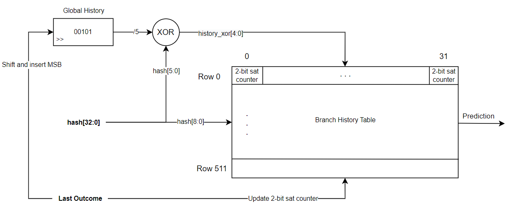
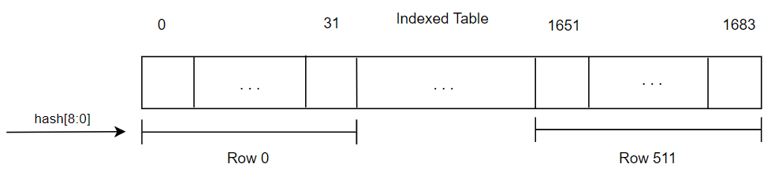
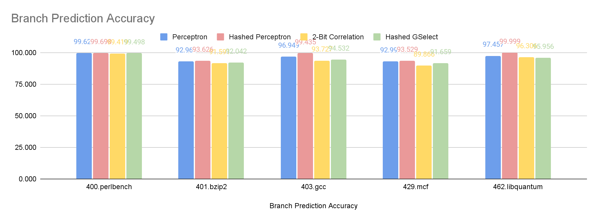

University of British Columbia  

*Isabelle Andre* 

# Table of Contents
1. [2-Bit Correlated Branch Predictor With 1-Bit History](#2-bit-correlated-branch-predictor-with-1-bit-history)
2. [Hashed GSelect Branch Predictor](#hashed-gselect-branch-predictor)

# Lab 4 Branch Predictor Implementation  
This assignment consisted in understanding the implementation of branch prediction policies using ChampSim. Two branch predictors were implemented. A 2-bit correlated branch predictor with a single bit of history was first created, followed by a hashed-gselect predictor with 5 bits of branch history. The hashing employs a XOR function to index the table. The performance of both branch predictors were compared against the hashed perceptron predictor across 5 different spec2006 workloads using geomean.

## Branch Predictor Implementation
In this assignment, two simple branch predictors were implemented using the ChampSim simulator. Each branch predictor offered a total budget of 16384 entries in a table with each entry being 2 bits in size. Bit manipulation was used to slice and dice this table as needed to be able to index the table rows and entries using the hash and history bits.

### 2-Bit Correlated Branch Predictor With 1-Bit History
#### Description
The 2-Bit Correlated Branch Predictor with 1 bit of history involves the use of 2-bit saturating counters with a minimum value of 0 and a maximum value of 3. For 1 bit of history, there are 2^1 = 2 entries per row, each containing a 2-bit saturating counter. Therefore to index the table rows, there must be 16384 entries/2 entries per row for a total of 8192 rows.
As the hash is a 32 bit integer, we take the 13 least significant bits for addressing 8192 rows, as they contain the most entropy.

This can be represented in a table format such as in Figure 2.1.



*Figure 2.1: 2-Bit Correlated Branch Predictor and 1 Bit of History as a Table*

#### Implementation
The majority of the implementation challenge related to bit manipulation for slicing the table of 16384 entries into the required table length and width as shown above.

First, the last 13 bits of the hash are extracted to use for row addressing by applying a mask to the address, obtaining a number in the range of [0, 8191]. Then, the index is multiplied by the number of entries per row known to be 2, to map the index to the corresponding entry in the array. Depending on the status of the history bit, the first or second entry of the row will be selected to predict the next branch outcome.

```
int mask = (1 << ADDRESS_BITS) - 1;
uint32_t index = (hash & mask)*ROW_SIZE;
```

The indexing of the branch history table can be seen in its unsliced state in Figure 2.2.



*Figure 2.2: Unsliced 1 Bit History Branch History Table*

Once the outcome of the prediction is received, the saturating counter is accessed once more to update its state. If the branch was taken, we increment the counter, otherwise, we decrement it.

### Hashed GSelect Branch Predictor
#### Description
The hashed gselect branch predictor works similarly to the gshare and gselect predictor. This implementation uses a XOR function to hash the address to index the entries. As 5 bits of history are used, there are 2^5 = 32 entries per row, each containing a 2-bit saturating counter. Therefore to index the table rows, there must be 16384 entries/32 entries per row for a total of 512 rows. As the hash is a 32 bit integer, we take the 9 least significant bits for addressing 512 rows, as they contain the most entropy.

The hashing process and table indexing is shown in Figure 2.3.



*Figure 2.3: Hashed GSelect Branch Predictor and 5 Bit History*

#### Implementation
First, the last 9 bits of the hash are extracted to use for row addressing by applying a mask to the address, obtaining a number in the range of [0, 511]. Then, the least significant 5 bits of the hash are extracted to XOR with the 5 bits of history to address each 2-bit saturating counter in a row. Depending on the output value of the XOR function, one of the 2-bit saturating counters of the 32 entry row will be selected to predict the next branch outcome.

```
int mask_hash = (1 << ADDRESS_BITS) - 1;
uint32_t index = (hash & mask_hash) * ROW_SIZE;

uint32_t hash_xor = index ^ history[cpu];

int mask_history = (1 << HISTORY_BITS) - 1;
int history_xor = (history[cpu] & mask_history);
```

The indexing of the branch history table can be seen in its unsliced state in Figure 2.4.



*Figure 2.4: Unsliced 5 Bit History Branch History Table*

## Performance Comparison
### Performance Per Benchmark
The performance of the 2-bit correlation with 1 bit history and the hashed gselect with 5 bit of history are analyzed by comparing their IPC, Branch Prediction Accuracy, MPKI Percentage, and ROB Occupancy at a Miss to the hashed perceptron branch predictor. As the hashed perceptron predictor is very good, we expect our results to be lower on average than its performance. The spec2006 benchmarks used include 400.perlbench, 401.bzip2, 403.gcc, 429.mcf, and 462.libquantum.



*Figure 3.2: CPU_0_Branch Prediction Accuracy Comparison*

### Geomean
To calculate the geomean of each branch predictor IPC compared to Hashed perceptron, we first normalize the data to calculate individual speedups for each workload, then take the quintic root of all speedups multiplied.

$$ Predictor Speedup over H.P. per Workload = {Predictor IPC \over Hashed Perceptron IPC}$$

$$ GEOMEAN(H.P, Predictor) = {\sqrt[5] {WL1 * WL2 * WL3 * WL4 * WL5}} $$

The resulting Geomean of each predictor compared to Hashed Perceptron IPC is
shown in Table 3.1.

| **Metric**                 | **Baseline** | **Reorder** | **Transposition** | **Blocking** |
|----------------------------|--------------|-------------|-------------------|--------------|
| Cumulative IPC             | 0.756089     | 1.58863     | 1.9689            | 0.977606     |
| L1D Miss Rate              | 266,451      | 28,898      | 24,686            | 8438         |
| L2C Miss Rate              | 137,886      | 15,604      | 12,503            | 3506         |
| LLC Miss Rate              | 5,587        | 5,240       | 4,950             | 688          |
| Branch Prediction Accuracy | 99.2247      | 99.2247     | 99.2231           | 80.0205      |  

*Table 3.1: Normalized Workloads and Speedup*